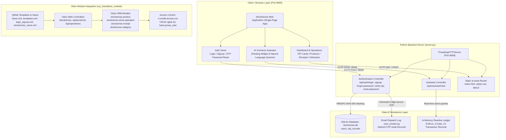
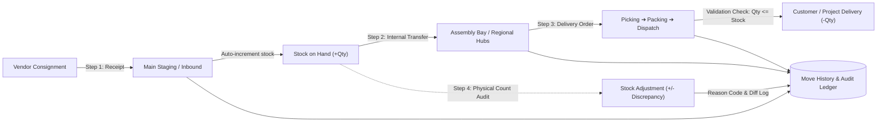
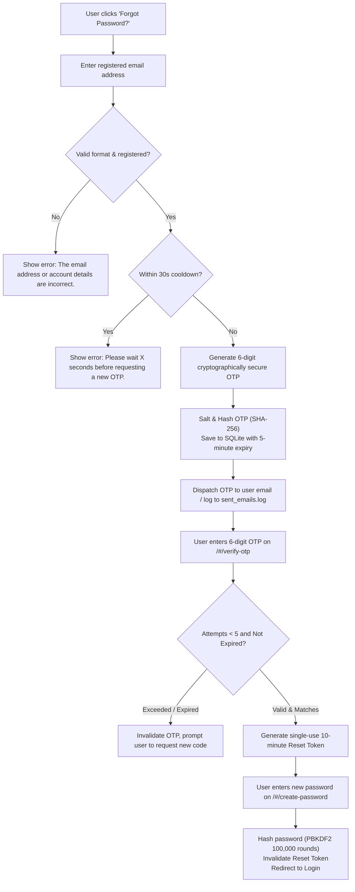
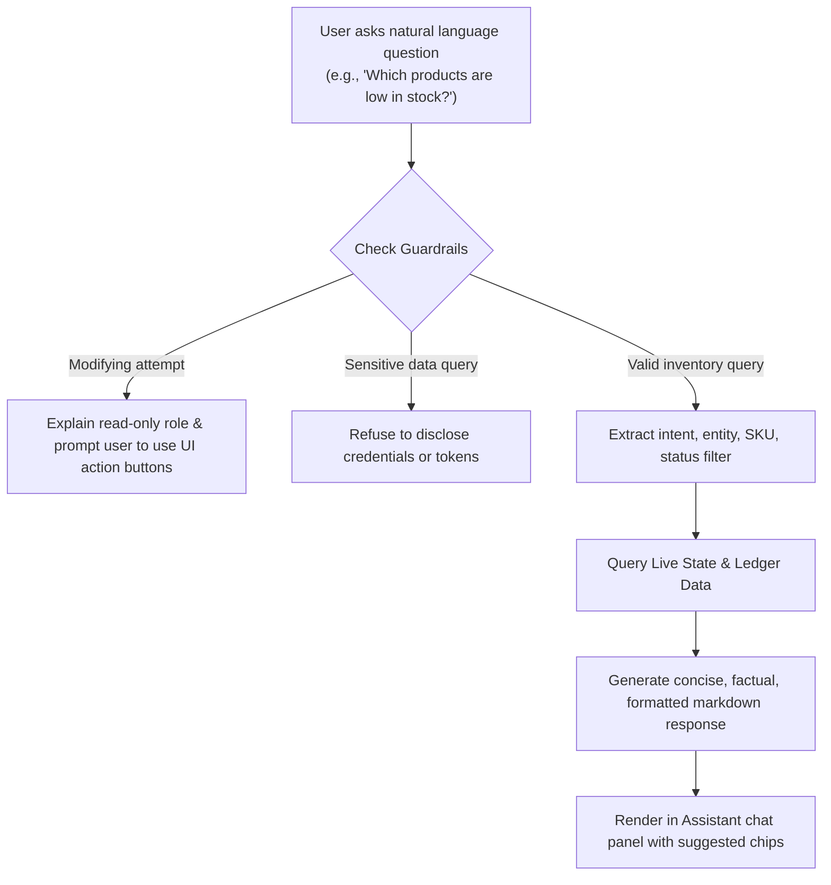

# StockSense — Modern Inventory Management System (IMS)

> **Enterprise Warehouse Operations & Odoo Hackathon Module**  
> Visual Reference: Modern Dark/Light Design System  
> Data Contract: Aligned with `contract_mock.json` and Odoo 16/17/18/20 Module Specs

---

## 🏗️ System Architecture & Workflow Flowcharts

### 1. End-to-End System Architecture



---

### 2. Warehouse Operations Lifecycle Flow



---

### 3. Production OTP-Based Password Reset Flow



---

### 4. AI Inventory Assistant Query Flow



---

## 🚀 Quick Start / How to Run & Preview

### Option A: Local Python Backend (Full Features with OTP & AI Assistant)
Run from inside this directory:
```powershell
python my_hackathon_module/server.py
```
Open your browser at:
```
http://localhost:8069/
```
- Real OTP password reset flow with SQLite persistence.
- Built-in live mock data & seed users:
  - `aarav.sharma@stocksense.in` (Inventory Operations Lead)
  - `vikram.m@stocksense.in` (Warehouse Staff)
  - `priya.p@stocksense.in` (Logistics Specialist)
  - `ananya.i@stocksense.in` (Procurement Manager)
- OTP emails are recorded in `my_hackathon_module/sent_emails.log`.

### Option B: Standalone File (Instant Browser Preview)
Open `my_hackathon_module/index.html` directly in any web browser without needing any server:
```powershell
start my_hackathon_module/index.html
```

### Option C: Odoo Module Installation
If installing inside an Odoo 16/17/18/20 environment:
1. Ensure `odoo_hackathon` or `my_hackathon_module` is in your `addons_path` in `odoo.conf`.
2. Update Apps list and install **StockSense – Inventory Management System**.
3. Access the full web application at `http://localhost:8069/stocksense` or via the top menu **StockSense IMS**.

---

## 📦 Directory Structure

```
my_hackathon_module/
├── README.md                    # Comprehensive documentation with flowcharts
├── index.html                   # Standalone self-contained web app (double-click preview)
├── standalone.html              # Portable standalone bundle
├── styles.css                   # Modern CSS design system (Inter, Plus Jakarta Sans, JetBrains Mono)
├── app.js                       # Frontend state machine, router, validators & simulation runner
├── server.py                    # Threading backend server with OTP auth & AI assistant API
├── stocksense.db                # SQLite database storing users, password hashes, and OTP records
├── sent_emails.log              # Audit log for dispatched OTP emails
├── contract_mock.json           # Data contract between backend and frontend
├── __manifest__.py              # Odoo module manifest with views, assets, and metadata
├── __init__.py                  # Python package initialization
├── models/
│   ├── __init__.py
│   ├── category.py              # StockSense category model
│   ├── product.py               # StockSense product model & Hackathon alias
│   ├── stock_picking.py         # Stock operations with automatic inventory validations
│   └── stock_receipt.py         # Stock receipts with automatic intake logic
├── controllers/
│   ├── __init__.py
│   └── main.py                  # HTTP controllers (/stocksense, /api/products, /api/operations)
├── views/
│   ├── views.xml                # Odoo backend menus, tree, and form views
│   ├── stocksense_views.xml     # Odoo 18/20 modern list and form views
│   ├── templates.xml            # QWeb frontend website template
│   └── login_signup.xml         # Modern login and signup templates
├── security/
│   └── ir.model.access.csv      # Access control lists for internal users
├── stocksense/                  # Modular backend package
│   ├── __init__.py
│   ├── __manifest__.py
│   ├── models/
│   │   ├── __init__.py
│   │   ├── category.py
│   │   ├── product.py
│   │   ├── stock_picking.py
│   │   ├── stock_receipt.py
│   │   └── models.py
│   ├── security/
│   │   └── ir.model.access.csv
│   └── views/
│       └── stocksense_views.xml
└── static/
    ├── description/
    │   └── index.html           # Odoo Apps Store module showcase
    └── src/
        ├── css/
        │   ├── styles.css       # Modular CSS stylesheet
        │   └── login_signup.css # Auth styles
        ├── js/
        │   └── app.js           # Modular JS application logic
        └── index.html           # Modular web app entry point
```

---

## 🎨 Key Features & Capabilities

1. **Warehouse Manager Control Tower**:
   - Real-time KPI summary: Total stock on hand, Low Stock items, Out of Stock items, Pending Receipts, Pending Deliveries, Internal Transfers.
   - Chronological operations ledger with search, category filtering, warehouse hub filtering, and status filtering.
2. **Interactive 4-Step Inventory Lifecycle Walkthrough**:
   - 1-Click Simulation Runner (`window.runDemoLifecycle()`) demonstrating:
     1. Inbound vendor receipt (+100 units)
     2. Intra-warehouse transfer (30 units relocated)
     3. Customer delivery order validation (-20 units dispatched)
     4. Physical inventory cycle count adjustment (-3 damaged units)
3. **Strict Stock Validation**:
   - Deliveries cannot exceed physical quantity on hand, preventing negative inventory.
   - Validation buttons automatically update product quantities, timestamps, and audit records.
4. **Production OTP-Based Password Reset**:
   - Secure forgot password flow with cryptographic salting, 5-minute validity, 30s resend rate-limiting, and 5-attempt brute-force protection.
5. **AI Inventory Assistant**:
   - Compact floating button in the bottom right corner.
   - Real-time contextual intelligence on stock levels, reorder alerts, pending shipments, and warehouse locations.
